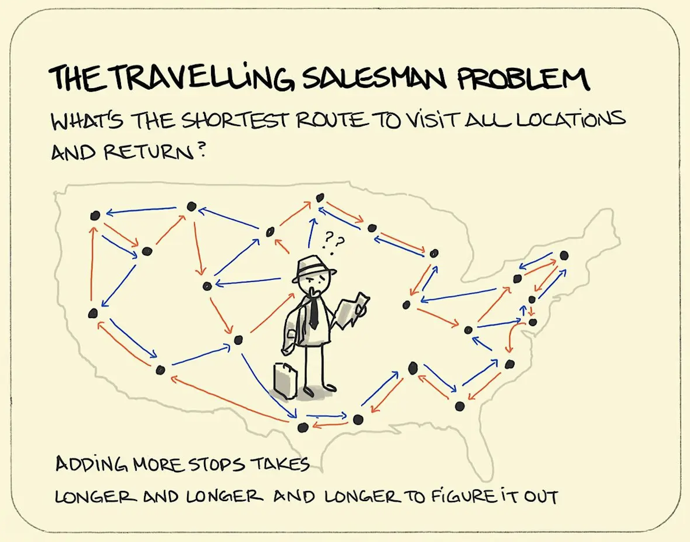

# 🌟 **Traveling Salesman Problem (TSP) Algorithms** 🌟

This repository is the **CS 566 2024** semester project, exploring various algorithms to solve the **Traveling Salesman Problem (TSP)**. The project implements, compares, and visualizes a diverse set of algorithms ranging from traditional optimization techniques to modern machine learning methods.

🌐 **GitHub Repository**: [TSP-Algorithms](https://github.com/Shuaijun-LIU/TSP-Algorithms)

---

## 📂 **Project Structure**

```plaintext
TSP_Algorithms/
│
├── main.py                 # Main script to run all algorithms
├── algorithms_runner.py    # Encapsulates algorithm execution logic
│
├── algorithms/             # Implementations of TSP algorithms
│   ├── __init__.py         # Package initializer
│   ├── ant_colony.py       # Ant Colony Optimization (ACO)
│   ├── adv_pso.py          # Advanced Particle Swarm Optimization (ADV-PSO)
│   ├── brute_force.py      # Brute Force Search
│   ├── dqn.py              # Deep Q-Learning (DQN)
│   ├── dynamic_programming.py  # Dynamic Programming (DP)
│   ├── greedy.py           # Greedy Algorithm
│   ├── mst_approximation.py  # MST Approximation Algorithm
│   ├── nearest_neighbor.py # Nearest Neighbor (NN) Algorithm
│   ├── pointer_networks.py # Pointer Networks (Deep Learning Method)
│   ├── pso.py              # Particle Swarm Optimization (PSO)
│   ├── simulated_annealing.py  # ❄️ Simulated Annealing (SA)
│
├── data/                   # Input TSP datasets
│   ├── tsp_example_1.json  # Example dataset with 5 cities
│   ├── tsp_example_50.json # Example dataset with 50 cities
│   ├── tsp_example_100.json  # Example dataset with 100 cities
│
├── results/                # Results and visualizations
│   ├── tsp_results.json    # Summary of results
│   ├── aco_path.png        # Example path visualization
│   ├── ...                 # Other algorithm-generated plots
│
├── utils/                  # Utility scripts
│   ├── __init__.py         # Package initializer
│   ├── plot_utils.py       # Visualization utilities
│   ├── tsp_utils.py        # Data loading and preprocessing
│   ├── results_utils.py    # JSON result saving utilities
│   ├── generate_data.py    # Random TSP dataset generator
│
├── .gitignore              # Files to ignore in version control
├── requirements.txt        # Python dependencies
└── README.md               # This README file
```

---

## 🎯 **Project Overview**

The **Traveling Salesman Problem (TSP)** is a classic optimization problem in computer science and operations research. Given a set of cities and distances between them, the goal is to find the shortest possible route that visits each city exactly once and returns to the origin city.

### **Goals**
- 🏆 Implement and compare a variety of algorithms to solve TSP.
- 🌟 Visualize results, including paths and convergence trends.
- 🚀 Provide modular and extensible code for further exploration of TSP solutions.

---

## 🧠 **Algorithms Implemented**

- 🐜 **Ant Colony Optimization (ACO)**
- 🚀 **Advanced Particle Swarm Optimization (ADV-PSO)**
- 🌌 **Particle Swarm Optimization (PSO)**
- 🤖 **Deep Q-Learning (DQN)**
- 🔗 **Pointer Networks (Deep Learning-Based Approach)**
- ❄️ **Simulated Annealing (SA)**
- 🧮 **Dynamic Programming (DP)**
- 💡 **Greedy Algorithm**
- 📍 **Nearest Neighbor (NN)**
- 🌲 **MST Approximation** (Based on Minimum Spanning Tree)
- 🛠️ **Brute Force Search**

---

## 🔧 **Installation and Setup**

### Prerequisites
- 🐍 **Python** 3.8 or higher
- `pip` for package management

### Installation
1. Clone the repository:
   ```bash
   git clone https://github.com/Shuaijun-LIU/TSP-Algorithms.git
   cd TSP-Algorithms
   ```

2. Set up a virtual environment (optional but recommended):
   ```bash
   python3 -m venv venv
   source venv/bin/activate  # Linux/Mac
   venv\Scripts\activate     # Windows
   ```

3. Install dependencies:
   ```bash
   pip install -r requirements.txt
   ```

---

## 🚀 **Usage**

### Running the Main Script
To execute all algorithms on a given TSP dataset, run:
```bash
python main.py
```

### Customizing Input Data
Replace the input file in `main.py` with your own TSP dataset:
```python
coordinates = load_tsp_data("data/your_tsp_data.json")
```

---

## ✨ **Data Generation**

Use the `generate_data.py` script in the `utils` folder to generate random TSP datasets.

Example:
```bash
python -c "from utils.generate_data import generate_tsp_data; generate_tsp_data(50, 'data/tsp_example_50.json')"
```

This command generates a dataset with 50 cities and saves it as `tsp_example_50.json`.

---

## 📊 **Results and Outputs**

### Outputs
1. **Path Visualizations**: Saved as PNG files in the `results/` folder.
   - Example: `aco_path.png`, `greedy_path.png`
2. **Convergence Graphs**: Showing cost trends for iterative algorithms.
   - Example: `aco_convergence.png`, `pso_convergence.png`
3. **Result Summary**: Saved as `tsp_results.json` in the `results/` folder.
   - Contains best paths, costs, and execution times for all algorithms.

### Sample Output
```json
{
    "Ant Colony Optimization": {
        "Best Path": [1, 2, 0, 4, 3],
        "Best Cost": 2.57,
        "Execution Time": 0.61
    },
    "Greedy Algorithm": {
        "Best Path": [0, 1, 2, 3, 4],
        "Best Cost": 3.12,
        "Execution Time": 0.01
    }
}
```

---

## 💡 **Acknowledgments**

This project was developed as part of the **CS 566 2024** semester coursework. Special thanks to the course instructors and TAs for their guidance.

Feel free to ⭐ the repository and contribute by submitting issues or pull requests! 
